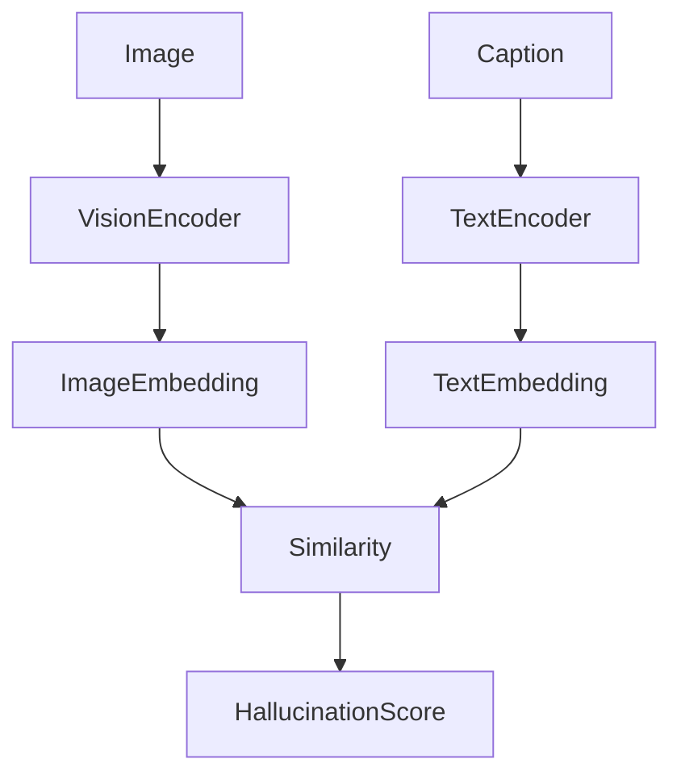

# Multimodal Hallucination Detector

## Overview
Detect hallucinated captions generated by vision-language models.

## Motivation
Large multimodal models sometimes generate descriptions that do not match the image.

## Architecture

Image → Vision Encoder → Embedding
Caption → Text Encoder → Embedding
Cosine Similarity → Hallucination Score

## Features
- Cross-modal similarity scoring
- Hallucination detection
- API interface
- Visualization dashboard

## Project Structure

## Installation
(pip install requirements)

## Usage
(run main.py)

## Results

