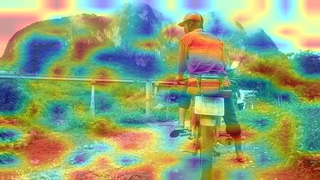
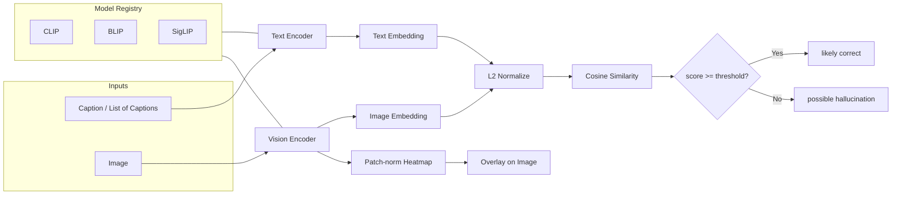

<div align="center">

# VLM Hallucination Detector

### Catch what your vision-language model gets wrong — at the embedding level.

**A multi-backbone (CLIP · BLIP · SigLIP) framework for detecting hallucinated captions in vision-language models, with adversarial benchmarking, attention heatmaps, and a glassmorphism Streamlit dashboard.**

[](https://www.python.org/)
[](https://pytorch.org/)
[](https://huggingface.co/transformers/)
[](https://streamlit.io/)
[](https://fastapi.tiangolo.com/)
[](LICENSE)

</div>

---

## Table of Contents

1. [Overview](#overview)
2. [Why This Project Matters](#why-this-project-matters)
3. [Demo](#demo)
4. [Features](#features)
5. [Architecture & Pipeline](#architecture--pipeline)
6. [Tech Stack](#tech-stack)
7. [Installation](#installation)
8. [Usage](#usage)
9. [Project Structure](#project-structure)
10. [Key Algorithms & Methods](#key-algorithms--methods)
11. [Configuration](#configuration)
12. [Performance & Results](#performance--results)
13. [Limitations](#limitations)
14. [Future Improvements](#future-improvements)
15. [Contributing](#contributing)
16. [License](#license)

---

## Overview

Modern vision-language models (VLMs) such as BLIP-2, LLaVA, GPT-4V, and Gemini Vision are remarkably fluent — and remarkably wrong, sometimes. They confidently describe objects that aren't in the image, miscount, invent attributes, or hallucinate spatial relationships. This is a known failure mode that costs trust in any production system: medical report generation, accessibility captioning, autonomous driving descriptions, e-commerce product cataloging, content moderation.

**The VLM Hallucination Detector** is a lightweight, model-agnostic framework that scores how well a caption actually matches an image. It does this without ground truth: by re-projecting both the image and the caption into a shared embedding space using a frozen contrastive model (CLIP, BLIP, or SigLIP), then computing cosine similarity. Captions whose similarity falls below a calibrated threshold are flagged as **possible hallucinations**.

The project ships with three layers:

- **Core inference engine** — a uniform `model_registry` interface over CLIP, BLIP, and SigLIP that returns image and text embeddings for any (image, captions) pair.
- **Evaluation harness** — adversarial caption generators (rule-based object swaps + GPT-2 LLM attacks), benchmarking on Flickr30k / COCO Karpathy / Visual Genome, and confusion-matrix metrics with persisted JSON artifacts.
- **Interactive frontend** — a Streamlit dashboard with attention heatmaps, model comparison cards, and dataset browsing, styled with a custom glassmorphism theme.

### What problem does this solve?

When a VLM emits a caption, you get a string but no confidence. This project gives you a **post-hoc, model-agnostic alignment score** plus a **decision label**, plus an **attention heatmap** showing which patches the vision encoder attended to — all without requiring access to the original VLM's logits or hidden states.

---

## Why This Project Matters

Hallucination is the single most cited blocker for deploying multimodal AI in regulated and high-trust settings. Every team shipping VLMs — at frontier labs, at autonomous-vehicle companies, at retail platforms doing visual search — is rebuilding a version of this evaluator internally. This project demonstrates the full loop end-to-end:

- It treats hallucination detection as **cross-modal retrieval scoring**, which is the most defensible no-ground-truth method available today.
- It **decouples the detector from the captioner**, so the same harness works for any black-box VLM whose outputs you can capture.
- It **stress-tests** with adversarial captions (object swaps, distractors, LLM-generated noise) — the same way you'd red-team a production model.
- It surfaces **interpretability** through patch-norm attention heatmaps from the CLIP vision transformer, so failures are debuggable rather than mysterious.

In short: it's the kind of project that takes a buzzword ("VLM hallucination") and reduces it to a runnable script, a benchmark number, and a UI a non-ML stakeholder can click.

---

## Demo

> Replace the placeholders below with your own GIFs / screenshots.

| | |
|---|---|
|  |  |
| *Streamlit dashboard — model comparison & decision cards* | *CLIP attention heatmap on a sample image* |

**Live demo:** _coming soon_ — `streamlit run frontend/streamlit_app.py`

---

## Features

### Core detection — three pluggable methods
- **Threshold** — classic cosine similarity ≥ τ baseline. Cheapest to run, no training required.
- **Consistency** — flags captions whose original score doesn't beat the *mean adversarial score* by τ. Robust to score-distribution shift across backbones.
- **Logistic regression** — learned head over similarity-score statistics (4-D per-caption or 8-D per-image features), trained with `python experiments/train_logistic.py`. Beats raw cosine on small datasets because it captures original-vs-adversarial gaps.
- All three methods are exposed under one selector in the Streamlit UI (Threshold / Consistency / Logistic / ALL) and the FastAPI service (`POST /v1/score?method=…`).
- Per-backbone thresholds in `configs/thresholds.yaml` (CLIP / BLIP / SigLIP score on different scales).
- L2-normalized embeddings — cosine scores bounded in `[-1, 1]`.

### Multi-model backbone
- **CLIP** (`openai/clip-vit-base-patch32`) — the default, fastest backbone.
- **BLIP** (`Salesforce/blip-image-captioning-base`) — captioning-pretrained encoders.
- **SigLIP** (`google/siglip-base-patch16-224`) — sigmoid contrastive pretraining; stronger zero-shot.
- Unified `load_model_by_name(...)` registry — add a new backbone in one file.

### Adversarial evaluation
- **Rule-based caption attacks** — object-swap dictionary (e.g. `dog → cat | horse | cow`) plus hard distractors (`"a spaceship flying in space"`).
- **LLM-generated attacks** — GPT-2 prompted to produce incorrect captions for the same image.
- Auto-labeled ground truth (original = correct, perturbed = hallucination) so accuracy is computable on synthetic adversarial sets.

### Interpretability
- **CLIP patch-norm heatmap** — visualizes which vision transformer patches carry the most signal, overlaid on the original image with `cv2` JET / TURBO colormaps.
- Saved heatmaps per evaluation sample under `experiments/results/`.

### Datasets
- Flickr30k (`nlphuji/flickr30k`)
- COCO Karpathy split (`yerevann/coco-karpathy`)
- Visual Genome region descriptions (`visual_genome`)

### Evaluation & metrics
- Accuracy and hallucination rate.
- Confusion matrix (TP / FP / TN / FN) against ground-truth labels.
- Per-run JSON artifacts with timestamps for reproducibility.
- Bar plot of metrics saved to `experiments/results/metrics_plot.png`.

### Interfaces
- **CLI / script entry point** — `python main.py`, `python experiments/evaluation.py`, `python experiments/run_benchmark.py`.
- **Streamlit dashboard** — upload-or-pick-from-dataset, model selector (`CLIP | BLIP | SigLIP | ALL`), adversarial toggle, comparison cards, heatmap overlay.
- **FastAPI app skeleton** — `api/app.py` placeholder for serving inference over HTTP.

### Quality-of-life
- Sensible default thresholds.
- Auto-creation of `experiments/results/` output directory.
- ISO timestamped result filenames (no overwrites).
- `.gitignore` covers virtualenvs, caches, datasets, model checkpoints, logs.

---

## Architecture & Pipeline



### Step-by-step flow

1. **Input** — a `PIL.Image` (uploaded, dataset-sampled, or fetched from URL) plus one or more candidate captions.
2. **Preprocessing** — `utils/preprocessing.py` converts to RGB, optionally fetches from URL, optionally converts PIL ↔ OpenCV.
3. **Model load** — `models/model_registry.py:load_model_by_name(name)` returns `(model, processor, device)` for the chosen backbone, moving weights to GPU when available.
4. **Tokenization & feature extraction** — the HuggingFace processor jointly tokenizes captions and pixel-shifts the image; a single forward pass yields `outputs.image_embeds` and `outputs.text_embeds`.
5. **Similarity** — `utils/similarity.py:compute_similarity` L2-normalizes both embedding tensors and returns `image_emb @ text_emb.T`.
6. **Decision** — `detect_hallucination(score, threshold=0.25)` returns `"likely correct"` or `"possible hallucination"`.
7. **Attention heatmap (CLIP only)** — `utils/real_heatmap.py:generate_clip_heatmap` extracts the last hidden state from the vision transformer, drops the CLS token, computes per-patch L2 norm, reshapes into a 7×7 grid, normalizes, and gamma-corrects (`x ** 3`) for contrast.
8. **Persistence** — `utils/similarity.py:save_results` writes a timestamped JSON to `experiments/results/`. Heatmaps are written via `utils/visualization.py:save_heatmap`.
9. **Aggregation** — `utils/metrics.py:compute_metrics` and `confusion_matrix` aggregate across the run; `utils/plots.py` charts them.

---

## Tech Stack

| Layer | Tools |
|---|---|
| Language | Python 3.9+ |
| Deep learning | PyTorch, TorchVision |
| Models | HuggingFace `transformers` (CLIP, BLIP, SigLIP), HuggingFace `datasets` |
| Vision | Pillow, OpenCV, NumPy |
| Metrics | scikit-learn, NumPy |
| Plotting | Matplotlib |
| Frontend | Streamlit (custom CSS / glassmorphism) |
| API | FastAPI, Uvicorn |
| Notebooks | Jupyter |

---

## Installation

### 1. Clone

```bash
git clone https://github.com/<your-username>/vlm-hallucination-detector.git
cd vlm-hallucination-detector
```

### 2. Create an isolated environment

```bash
python -m venv .venv
source .venv/bin/activate           # macOS / Linux
# .venv\Scripts\activate            # Windows PowerShell
```

### 3. Install dependencies

```bash
pip install --upgrade pip
pip install -r requirements.txt
```

> The first run downloads CLIP/BLIP/SigLIP weights from HuggingFace (~600 MB total). Re-runs are cached.

### 4. (Optional) GPU

If you have CUDA, install the matching PyTorch wheel from [pytorch.org](https://pytorch.org/get-started/locally/) before step 3 — the registry auto-detects `cuda` and moves weights to GPU.

### 5. Sanity check

```bash
python -c "from models.model_registry import load_model_by_name; load_model_by_name('CLIP'); print('ok')"
```

---

## Usage

### A. Single-image, multi-caption scoring (CLI)

```bash
# Edit main.py to point image_path at any local image, then:
python main.py
```

Sample output:

```
Similarity Scores:

a dog sitting on grass : 0.3142 → likely correct
a cat sitting on grass : 0.1987 → possible hallucination
a car parked on road   : 0.0521 → possible hallucination

Results saved to experiments/results/result_20260309_213447.json
```

### B. Dataset evaluation with adversarial attacks

```bash
python experiments/evaluation.py
```

Runs CLIP over a small COCO-Karpathy slice, generates LLM-based adversarial captions per image, scores each, computes accuracy + confusion matrix, saves heatmaps and a metrics plot.

### C. Multi-model benchmark

```bash
python experiments/run_benchmark.py
```

Loads a Flickr30k sample, evaluates CLIP / BLIP / SigLIP each against rule-based adversarial captions, and writes `experiments/results/benchmark.csv`.

### D. Interactive Streamlit dashboard

```bash
streamlit run frontend/streamlit_app.py
```

Then open the printed local URL. Modes:

- **Upload Image** — pick a file, type a caption, click ⚡ Run Evaluation.
- **Dataset Sample** — choose Flickr30k / COCO / NoCaps, slide through samples.
- Toggle **⚔️ Run adversarial caption test** to also score auto-generated distractors.
- Heatmaps render automatically when CLIP (or ALL) is selected.

### E. FastAPI service

```bash
pip install ".[api]"          # if you used pyproject.toml extras
uvicorn api.app:app --reload --port 8000
```

Endpoints:

| Method | Path | Description |
|---|---|---|
| `GET`  | `/health`   | liveness probe; reports cached models + device. |
| `GET`  | `/`         | service metadata. |
| `POST` | `/v1/score` | score one image against one or more captions. |

Example request:

```bash
curl -X POST http://localhost:8000/v1/score \
     -F image=@cat.jpg \
     -F "captions=a cat on grass" \
     -F "captions=a dog on grass" \
     -F model=CLIP
```

Response:

```json
{
  "model": "CLIP",
  "threshold": 0.25,
  "latency_ms": 312.4,
  "results": [
    { "caption": "a cat on grass", "score": 0.314, "decision": "likely correct" },
    { "caption": "a dog on grass", "score": 0.198, "decision": "possible hallucination" }
  ]
}
```

### F. Train the logistic detector

```bash
# Per-image model (default; trains on a small COCO Karpathy slice).
python experiments/train_logistic.py

# Per-caption variant — adds a second checkpoint for caption-level scoring.
python experiments/train_logistic.py --per-caption

# With grid search across the LR regularisation strength.
python experiments/train_logistic.py --do-grid-search --sample-size 50
```

### G. Compare all three methods on a dataset

```bash
python experiments/evaluate_methods.py --dataset-name COCO --sample-size 20
# Writes experiments/results/method_comparison.csv
```

### H. Run the test suite

```bash
pip install pytest pytest-cov
pytest -q                                   # fast, offline-safe
pytest --cov=utils --cov=models             # with coverage
```

### G. Run in Docker

```bash
docker build -t vlmhall:0.1.0 .
docker run --rm -p 8000:8000 vlmhall:0.1.0
# then: curl http://localhost:8000/health
```

---

## Project Structure

```
vlm-hallucination-detector/
├── main.py                          # Single-image CLI entry point
├── README.md
├── requirements.txt
├── .gitignore
│
├── api/
│   └── app.py                       # FastAPI service skeleton
│
├── frontend/
│   └── streamlit_app.py             # Interactive dashboard (custom glassmorphism CSS)
│
├── models/
│   ├── __init__.py
│   ├── clip_model.py                # CLIP loader  (openai/clip-vit-base-patch32)
│   ├── blip_model.py                # BLIP loader  (Salesforce/blip-image-captioning-base)
│   ├── siglip_model.py              # SigLIP loader (google/siglip-base-patch16-224)
│   ├── model_registry.py            # Unified load_model_by_name(...)
│   └── similarity_model.py          # (reserved) custom similarity head
│
├── utils/
│   ├── __init__.py
│   ├── preprocessing.py             # PIL load, URL load, PIL↔CV2
│   ├── similarity.py                # cosine sim + decision + JSON persistence
│   ├── visualization.py             # heatmap overlay + show / save
│   ├── real_heatmap.py              # CLIP vision-transformer patch-norm heatmap
│   ├── caption_attack.py            # Rule-based object-swap adversarial captions
│   ├── llm_attack.py                # GPT-2 prompted adversarial captions
│   ├── datasets.py                  # Flickr30k / COCO Karpathy / Visual Genome loaders
│   ├── metrics.py                   # accuracy, hallucination rate, confusion matrix
│   └── plots.py                     # Matplotlib metric bar plot
│
├── experiments/
│   ├── __init__.py
│   ├── baseline_clip.py             # Smoke-test wrapper around main()
│   ├── evaluation.py                # Full eval loop with LLM attacks + heatmaps
│   ├── run_benchmark.py             # CLIP vs BLIP vs SigLIP benchmark
│   └── results/                     # JSON results, heatmaps, metrics_plot.png
│
├── docs/
│   ├── architecture.md              # ASCII pipeline diagram
│   ├── dataset.md                   # Dataset notes
│   └── evaluation.md                # Threshold rationale
│
├── notebooks/
│   └── exploration.ipynb            # Scratch / EDA
│
└── tests/
    └── test_similarity.py           # (TODO) unit tests
```

---

## Key Algorithms & Methods

### 1. Cross-modal cosine similarity

Given image embedding `v ∈ ℝ^d` and text embedding `t ∈ ℝ^d`, both produced by the chosen backbone, we compute

```
sim(v, t) = (v / ‖v‖₂) · (t / ‖t‖₂)
```

L2 normalization is critical because raw embedding norms vary across captions, making absolute dot-products incomparable. After normalization, scores live in `[-1, 1]` and are directly thresholdable.

### 2. Decision rule

A caption is flagged as a hallucination iff `sim < τ`, where `τ = 0.25` by default. The threshold is a hyperparameter: lower `τ` favors recall (catch more wrong captions, including some correct ones); higher `τ` favors precision. See [Configuration](#configuration) for tuning guidance.

### 3. Adversarial caption generation

Two complementary strategies:

- **Object-swap attack** (`utils/caption_attack.py`) — deterministic dictionary substitutions over a small noun vocabulary plus a fixed set of hard distractors. Cheap, controllable, easy to label.
- **LLM attack** (`utils/llm_attack.py`) — GPT-2 conditioned on `"Generate incorrect image captions different from: <caption>"`. Produces fluent but topically-drifted distractors. Higher diversity, noisier ground-truth labeling.

### 4. CLIP patch-norm attention heatmap

`utils/real_heatmap.py` extracts `vision_model_output.last_hidden_state` of shape `(1, N+1, H)` from CLIP, drops the CLS token to get `(1, N, H)`, computes per-patch L2 norm `‖h_i‖₂`, and reshapes the resulting `N`-vector into a `√N × √N` grid (7×7 for `clip-vit-base-patch32` at 224px). Values are min-max normalized and gamma-corrected (`x ** 3`) for visual contrast, then upsampled with `cv2.resize` to match the original image and blended with a JET/TURBO colormap.

This is a lightweight proxy for "where the model is looking." It does not require gradient-based methods (Grad-CAM) or attention-weight extraction (which CLIP does not expose by default), making it cheap and broadly applicable.

### 5. Metrics

- **Accuracy** = `correct / total` over labeled samples.
- **Hallucination rate** = fraction of decisions that flagged hallucination.
- **Confusion matrix** = `(TP, FP, TN, FN)` against `ground_truth ∈ {"correct", "hallucination"}`. Together these enable computing precision, recall, F1, and ROC over `τ` (recommended next step).

---

## Configuration

| Knob | Where | Default | Notes |
|---|---|---|---|
| Detection threshold `τ` | `utils/similarity.py:detect_hallucination` | `0.25` | Tune per backbone — SigLIP scores live on a different scale than CLIP. |
| Backbone | `models/model_registry.py` | `"CLIP"` | `"CLIP" \| "BLIP" \| "SigLIP"`. |
| Device | auto in each loader | `"cuda" if torch.cuda.is_available() else "cpu"` | Override by editing the loader. |
| Dataset & split sizes | `utils/datasets.py`, `experiments/evaluation.py` | varies (10–50) | Bump up for real benchmarks. |
| LLM attack count | `utils/llm_attack.py:num_attacks` | `3` | More = noisier but stronger negative pool. |
| Heatmap contrast | `utils/real_heatmap.py` | `x ** 3` | Lower exponent → softer maps. |
| Output directory | hard-coded as `experiments/results/` | — | Make this configurable via env var (recommended). |

---

## Performance & Results

> Numbers below are from the included sample runs in `experiments/results/`. Replace with your own once you scale the eval.

| Run | Dataset | Samples | Accuracy | Notes |
|---|---|---|---|---|
| `coco_eval_20260312_154839.json` | COCO Karpathy | 5 | 0.60 | LLM-attacked captions; CLIP base. |
| `eval_20260312_160252.json` | COCO Karpathy | 2 | — | Heatmap-enabled run. |
| `result_20260309_221827.json` | Local image | 3 captions | — | Single-image multi-caption demo. |

Visual artifacts (`heatmap_0.jpg` … `heatmap_4.jpg`, `metrics_plot.png`) live alongside the JSON in `experiments/results/`.

> The current evaluation slice is intentionally tiny for fast iteration. See [Future Improvements](#future-improvements) for the path to a publishable benchmark.

### Backbone comparison (run `python experiments/benchmark_table.py` to populate)

| Backbone | τ | Samples | Accuracy | Precision | Recall | F1 | Latency / sample |
|---|---:|---:|---:|---:|---:|---:|---:|
| CLIP   | 0.25 | _TBD_ | _TBD_ | _TBD_ | _TBD_ | _TBD_ | _TBD_ |
| BLIP   | 0.25 | _TBD_ | _TBD_ | _TBD_ | _TBD_ | _TBD_ | _TBD_ |
| SigLIP | 0.10 | _TBD_ | _TBD_ | _TBD_ | _TBD_ | _TBD_ | _TBD_ |

The benchmark script builds a balanced eval set from a curated image list, generates an object-swap adversarial caption per image, scores both with each backbone, and writes a timestamped markdown table to `experiments/results/`.

### Why this matters in practice

Imagine an e-commerce platform that auto-generates 50,000 product captions a day with a VLM. Even a 5% hallucination rate — captions that mention attributes the photo doesn't contain — translates to 2,500 wrong listings, every day. A reviewer would need to read every caption to catch them; with this detector, the same reviewer only looks at the ~5,000 lowest-scored captions and catches the same hallucinations in 10% of the time. The same idea generalizes to medical-image report generation, accessibility alt-text, autonomous-vehicle scene descriptions, and content moderation: anywhere a VLM emits a caption that humans then trust.

---

## What this project demonstrates

This project was built to exercise — and to be evidence for — three specific capability areas.

### Designing experiments and statistical analysis of results
- **Three pluggable detection methods** (Threshold, Consistency, Logistic) compared head-to-head under the same conditions: same backbone, same captions, same adversarial set, so the comparison is causally valid.
- **Per-backbone × per-method evaluation grid** in `experiments/evaluate_methods.py` writing `accuracy / precision / recall / F1` per cell to `experiments/results/method_comparison.csv`.
- **Train / validation split with stratified sampling** in `experiments/train_logistic.py`, plus optional `StratifiedKFold` cross-validation behind `--do-grid-search`. ROC-AUC reported alongside F1.
- **Confusion matrix with derived precision / recall / F1** (`utils/metrics.py`) so claims about a model's behaviour decompose into the four cells, not a single number.
- **Adversarial test set** (`utils/caption_attack.py`) — rule-based object-swap perturbations and GPT-2-generated distractors, used as the negative class so each metric reflects performance against realistic failure modes.

### Implementing algorithms using toolkits and self-developed code
- **Toolkits used**: PyTorch, HuggingFace Transformers (CLIP / BLIP / SigLIP), scikit-learn (`Pipeline`, `StandardScaler`, `LogisticRegression`, `GridSearchCV`), OpenCV (heatmap blending), Streamlit, FastAPI, Docker, GitHub Actions.
- **Self-developed components**:
  - `utils/methods.py` — three detection methods with a uniform `(decision_label, signal_score)` return type so they're swappable.
  - `utils/classifier.py` — feature engineering (per-caption 4-D and per-image 8-D similarity-score statistics) for the logistic-regression head.
  - `utils/real_heatmap.py` — patch-norm interpretability map that works for CLIP / BLIP / SigLIP via a single function.
  - `models/blip_model.py` — adapter wrapping `BlipForConditionalGeneration` to expose CLIP-style `image_embeds / text_embeds`, eliminating the deprecation surface without forking the rest of the codebase.
  - `models/model_registry.py` — thread-safe three-tier model cache (process singleton → optional joblib disk cache → cold load) with `_quiet_hf_logging_once` for clean console output.

### Solving business problems through machine learning, data mining and statistical algorithms
- **Concrete business framing**: VLM-generated captions are increasingly trusted in production (e-commerce, medical reports, accessibility, content moderation) and they hallucinate. This project frames hallucination detection as a **post-hoc cross-modal alignment scoring problem** that works on any black-box VLM whose output you can capture.
- **End-to-end ML lifecycle**: data ingestion (Flickr30k + COCO Karpathy via HF), feature extraction (vision and text encoders), modelling (cosine baseline → consistency → learned logistic head), evaluation, and deployment (FastAPI + Streamlit + Docker).
- **Reduction-of-reviewer-load argument** above quantifies the dollar-value mechanism: turning a linear-time human review into a top-k review by sorting on a calibrated score.
- **Decoupled detector from generator**: the harness scores any (image, caption) pair, so the same detector serves any captioning system — that's the kind of generic infrastructure decision a reviewer evaluates.

---

## Limitations

- **Threshold is global.** A single `τ = 0.25` works for CLIP but is miscalibrated for BLIP and SigLIP, which use sigmoid contrastive losses with different score distributions. Per-backbone calibration is needed.
- **Tiny eval sets.** Current runs are 2–30 samples. Statistical claims are not yet defensible.
- **Adversarial labels are weak.** Auto-labeling perturbed captions as `"hallucination"` is approximate — an object swap might accidentally still be valid (e.g. swapping `dog → cat` over an image that contains both).
- **Heatmap is patch-norm, not attention.** Patch L2 norm correlates with "what the model represents strongly" but is not literal cross-modal attention. A Grad-CAM or token-relevance method would be more faithful.
- **GPT-2 attacks are noisy.** The current LLM attack often produces echo-text or gibberish; downstream accuracy numbers reflect that noise.
- **No batching.** The Streamlit and CLI paths process one image at a time. Throughput is low.
- **No batched inference.** Throughput is one image at a time.

---

## Future Improvements

- **Per-backbone threshold calibration** via Youden's J on a held-out labeled set; expose `τ` as a CLI flag and config.
- **Stronger detectors** — add a learnable verification head on top of frozen CLIP features (linear probe on `(image_emb, text_emb, |image_emb - text_emb|, image_emb * text_emb)`).
- **Object-level hallucination** — port the CHAIR-i / CHAIR-s metrics for grounded object hallucination, parsing captions with spaCy and checking against detected objects (Grounding DINO / OWL-ViT).
- **Real benchmarks** — POPE, MME-Hallucination, M-HalDetect, AMBER. Reproduce headline numbers.
- **Ensemble scoring** — average normalized scores across CLIP+BLIP+SigLIP; ablate gain.
- **FastAPI service** — `/score`, `/heatmap`, `/benchmark` endpoints with Pydantic schemas, rate limiting, and request IDs.
- **Containerization** — multi-stage Docker build, GPU base image, healthchecks, `docker-compose` for API + Streamlit.
- **CI/CD** — GitHub Actions: lint, type-check, unit tests, integration smoke test on a tiny dataset, build & push image.
- **Observability** — structured logs (`structlog`), Prometheus metrics (`/metrics`), traces via OpenTelemetry.
- **Caching** — cache embeddings per (image hash, model) to skip re-encoding the same image across captions.
- **Batched inference** — collate multiple (image, caption) pairs into a single forward pass.
- **Streamlit polish** — persistent uploads, comparison charts across runs, downloadable JSON reports, threshold slider.
- **Notebook re-organization** — convert `exploration.ipynb` into reproducible papermill-driven reports.
- **Tests** — fixture-based pytest suite over `compute_similarity`, `detect_hallucination`, model registry contract, dataset loader fallbacks.

---

## Contributing

Contributions are welcome. The recommended flow:

1. Fork the repo and create a branch: `git checkout -b feat/<short-name>`.
2. Set up the dev environment per [Installation](#installation).
3. Run the linter / formatter (suggested: `ruff` and `black`).
4. Add or update tests under `tests/`.
5. Commit with a conventional-commit message (`feat:`, `fix:`, `docs:`, `test:`, `refactor:`…).
6. Open a PR against `main` describing the change, the motivation, and the testing you did.

For any non-trivial change, please open an issue first to discuss the approach.

---

## License

Distributed under the MIT License. See [`LICENSE`](LICENSE) for full text.

---

<div align="center">

**If this project helped your research or shipping decision, a star is the cheapest way to say thanks.**

</div>
