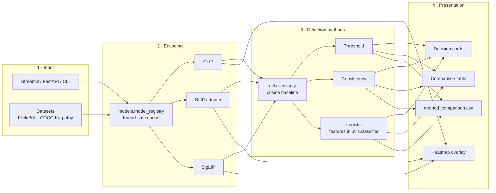
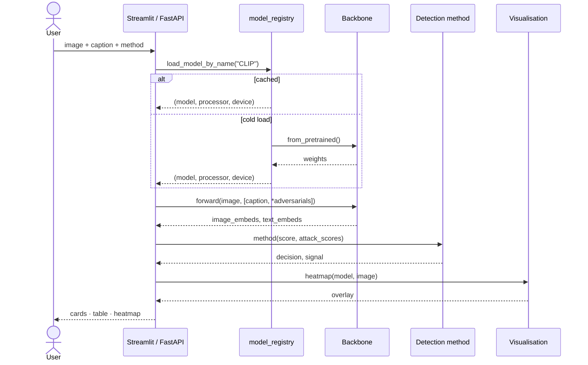

# System Architecture

The detector is structured as four loosely-coupled layers — input, encoding,
detection, and presentation. Layers communicate through narrow interfaces
(PIL `Image`, plain `str`, `torch.Tensor`, list-of-dict), so each one can be
swapped in isolation.

## High-level flow

## Per-request sequence

## Module responsibilities

| Layer | Module | Responsibility |
|---|---|---|
| Input | `utils.datasets` | Load Flickr30k / COCO Karpathy via HuggingFace, lazy-fetch URL images via `cast_column("url", Image())`. |
| Input | `utils.caption_attack` | Generate adversarial caption variants (object swaps + hard distractors). |
| Encoding | `models.model_registry` | Three-tier cache (process singleton → optional joblib disk cache → cold load). Quiets HuggingFace logs. |
| Encoding | `models.{clip,blip,siglip}_model` | Backbone-specific loaders. BLIP wraps `BlipForConditionalGeneration` to expose CLIP-style outputs. |
| Detection | `utils.similarity` | Cosine baseline + threshold decision. |
| Detection | `utils.methods` | Three pluggable methods (Threshold / Consistency / Logistic), uniform return shape. |
| Detection | `utils.classifier` | Per-caption (4-D) and per-image (8-D) feature engineering for the logistic head. |
| Detection | `experiments.train_logistic` | Sklearn `Pipeline` (`StandardScaler` + `LogisticRegression`) with optional grid search. |
| Detection | `experiments.evaluate_methods` | Side-by-side method comparison + CSV output. |
| Presentation | `frontend.streamlit_app` | Dashboard: input → run → cards → comparison → heatmaps. |
| Presentation | `api.app` | FastAPI service: `GET /health`, `POST /v1/score`. |
| Presentation | `utils.real_heatmap` | Patch-norm activation map for CLIP / BLIP / SigLIP. |
| Presentation | `utils.visualization` | OpenCV overlay + Matplotlib display / save. |

## Data shapes at each boundary

| Boundary | Shape |
|---|---|
| Input → encoder | `PIL.Image.Image` (RGB) + `List[str]` |
| Encoder → similarity | `torch.Tensor` of shape `(B, D)` per modality |
| Similarity → method | `float` per (image, caption) pair |
| Method → presentation | `(decision_label: str, signal: float)` |
| Heatmap → overlay | `np.ndarray` of shape `(H, W)` in `[0, 1]` |
